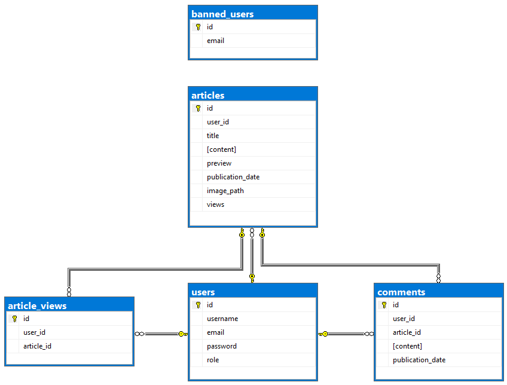

# Knotty Blog – Final Project for Mobile Development Course

This project was developed as the final assignment for a Mobile Application Development course.  
Knotty Blog is a mobile blogging platform built using Java in Android Studio. It features user authentication, article creation and management, and admin-level controls. The app features a custom visual theme based on ropes — a playful nod to its name — while remaining fully safe for work.

> This project is for educational purposes only and not intended for production use.

---

## Features

### General User Features
- Register with a username, email, and password
- Secure login screen and session handling
- View a scrollable list of articles as stylish cards, each with:
  - A background image (rope-themed by default)
  - Title
  - Preview (either a custom summary or the article's first sentence)
- Tap any article to view its full content and publication date
- Articles include a view count (incremented per unique viewer)
- Create new articles with title, content, optional image from gallery, and optional preview of the article
- Edit or delete your own articles
- View other user's articles in read-only mode

### Admin Features
- Admin account is created on first launch (username: `admin`, password: `admin`)
- Admin can:
  - View, create, edit, and delete any article
  - Add custom previews for any article
  - Access a user management interface to:
    - View registered users
    - Quickly create multiple test users
    - Delete or ban users

---

## Technologies Used

| Technology       | Purpose                                      |
|------------------|----------------------------------------------|
| Java             | Main programming language for app logic      |
| Android Studio   | Development environment                      |
| XML              | UI layout and styling                        |
| SQLite           | Local database for persistent storage        |
| SharedPreferences| Session and user role storage                |
| RecyclerView     | Display of article cards                     |
| Fragments        | Dynamic screen management                    |

---

## How to Run the App

> Prerequisites: Android Studio and a device/emulator running Android API 30+

1. Clone the repository and open it in Android Studio

```bash
git clone https://github.com/LiliDeme/knotty-blog.git
```

2. Build and run the project on an emulator or physical device

3. On first launch, an admin account is automatically created:
```
Username: admin
Password: admin
```

---

## Future Plans

- [ ] Translate all UI and interface elements to English in the intent of adding the app to a portfolio 
- [ ] Add full code comments for clarity and documentation (wasn't asked for the assignment)
- [ ] Implement an external database
- [ ] Finalize the comment section under articles (table created in the database and UI partially implemented)
- [ ] Add article search by keyword
- [ ] Refine user session and security handling

---

## Demo & Test Files

- [Test PDF with screenshots](test.pdf)
- [Demo video](test.mp4)

### Database Schema

The following diagram illustrates the structure of the app’s local SQLite database:



---

## Author

Liliane Demers
Junior Software Developer
[LinkedIn – Liliane Demers](https://www.linkedin.com/in/lilianedemers)

## License

This project is for educational purposes and not intended for production use.
